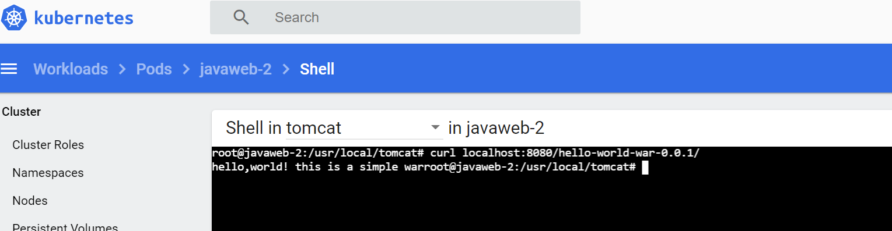

该项目是使用`springboot`打包成war包，可以实现在tomcat中运行。

使用了`spotify`的`dockerfile-maven-plugin`来实现`Dockerfile`的打包，并推送镜像到中央仓库中。

之后可以使用`kubernets` 进行部署项目

主要命令

```

// 打war包
// 做镜像并推送
// 使用kubectl apply -f XXXX.yml

```



